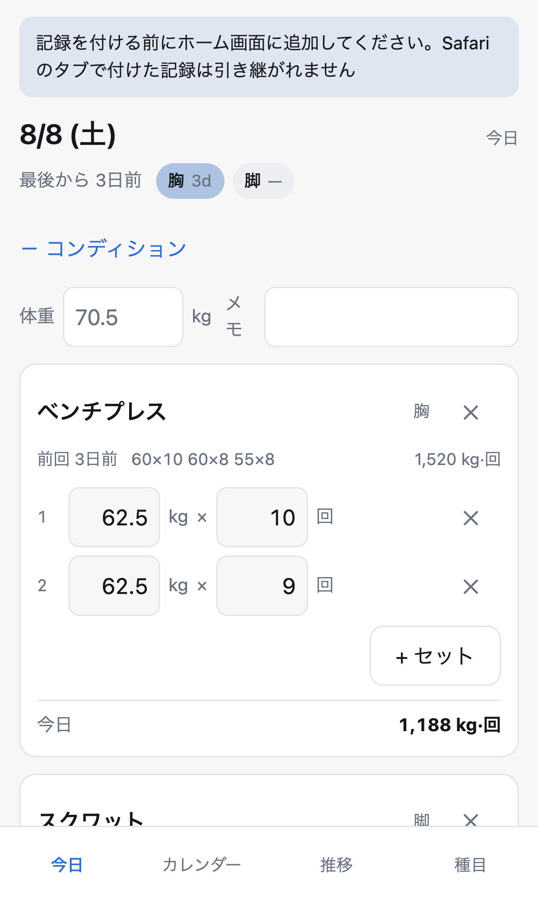
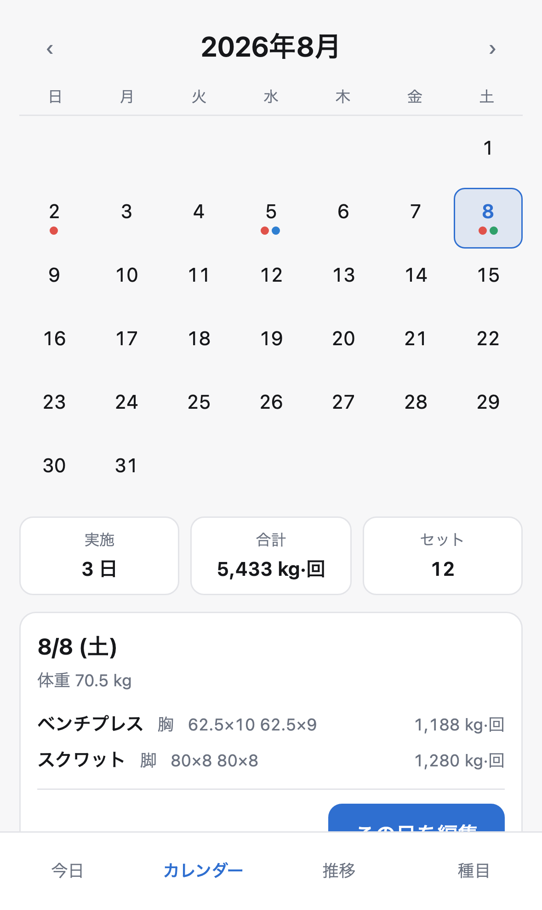
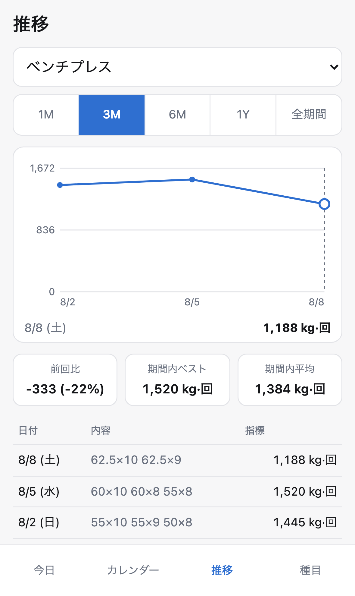
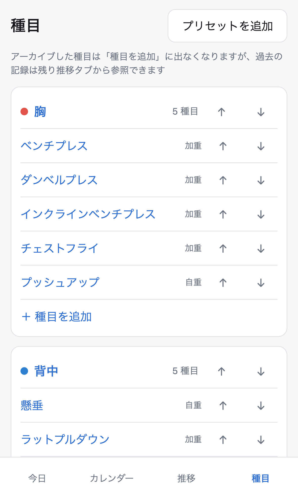

# 筋トレメモ

iPhone のホーム画面から起動して完全オフラインで動く、個人用の筋トレ記録 PWA。
サーバ通信もアカウント登録も持たず、記録は端末の `localStorage` にのみ保存する。
「前回何をどれだけやったかを見て、同じかそれ以上をやる」というループだけを最短手数で回すことに絞っている。

公開先: <https://asugawara.github.io/fitness-memo/>

## 画面

| 今日 | カレンダー | 推移 | 種目 |
|---|---|---|---|
|  |  |  |  |

## 主な機能

- **前回の参照とコピー** — 種目ごとに前回のセット数・レップ数・重量を表示する。その日のセットがまだ空のときだけ「前回をコピー」が出て、ワンタップで今日の入力欄にプリフィルできる。
- **カレンダーからの記録追加** — 月グリッドで実施日を部位カラーのドットで表示する。記録が無い日をタップしても「この日に記録する」から追加できるので、前日の記録し忘れを後から入れられる。
- **部位ごとのグループ分け** — 胸 / 背中 / 肩 / 腕 / 脚 / 体幹 の 6 部位に 28 種目をプリセットとして初期投入する。部位も種目も追加・改名・並び替え・削除ができる。
- **仕事量のグラフ** — 種目別は指標（加重種目なら Σ(重量 × レップ)）、部位別はセット数を折れ線で表示する。期間は 1M / 3M / 6M / 1Y / 全期間。
- **最後のトレーニングからの経過時間** — 全体と部位ごとに表示する。過去日にさかのぼって記録した分は日粒度に落として表示する（「たった今」と誤表示しないため）。
- **体重と体調メモ** — 日ごとに 1 行で記録できる。

種目には「指標の種類」を明示的に持たせている（加重 = `kg·回` / 自重 = `回` / 時間 = `秒`）。データから推論しないので、自重種目に加重を足しても過去のグラフが遡って壊れない。

## 技術構成

| 項目 | 選択 |
|---|---|
| 言語 / フレームワーク | Rust + [leptos](https://leptos.dev/) 0.8（CSR）。ビルドは [trunk](https://trunkrs.dev/) |
| ルーティング | なし。タブは enum の signal で切り替える |
| グラフ | ライブラリを使わず SVG を自前で描画 |
| 永続化 | `localStorage` の単一キー `fitness-memo/v1` に JSON 全体 |
| CSS | 素の CSS 1 ファイル + CSS 変数 |
| デプロイ | GitHub Pages の branch deploy（`release` ブランチの `/docs`） |
| CI | **GitHub Actions のワークフローファイルを書かない。** `.githooks/pre-commit` でローカル実行する |

UI 層（`leptos` / `web-sys` に依存する部分）は `[target.'cfg(target_arch = "wasm32")'.dependencies]` に置いてあるので、`cargo test` はホスト向けに leptos の依存グラフをビルドしない。純ロジックは `src/core.rs` に集約してあり、ここが単体テストの主対象になる。

## 開発

### 前提ツール

- [rustup](https://rustup.rs/)（`rust-toolchain.toml` で stable と `wasm32-unknown-unknown` を宣言しているので、リポジトリ内での初回実行時にターゲットは自動で入る）
- trunk — `brew install trunk`
- Node.js（Playwright 用）

### セットアップ

```sh
sh scripts/setup.sh
```

`git config core.hooksPath .githooks` でフックを有効化し、`npm install` と Playwright のブラウザ（Chromium / WebKit）を入れる。**このスクリプトを実行しないと `pre-commit` は一度も発火しない。** GitHub Actions のワークフローを持たない構成なので、`pre-commit` が唯一の防波堤になる。

### 開発サーバ

```sh
trunk serve
```

<http://localhost:8080> で起動する。**この 8080 番では Service Worker を登録しない**（`index.html` が `location.port` で判定している）。開発中に cache-first の Service Worker に捕まって古い成果物を見続ける事故を避けるため。すでに登録済みの Service Worker を外したいときは `?sw=off` を付けて 2 回リロードする。

### テスト

```sh
cargo test                              # src/core.rs の純ロジック（ホスト）
trunk build                             # dist/ を作る（E2E はこれを配信する）
npx playwright test --project=chromium  # 軽い E2E
npx playwright test                     # 全 project（Chromium / iPhone 15 Pro (WebKit) / Pixel 7）
```

`.githooks/pre-commit` は `main` への `docs/` 混入をガードしたうえで、`cargo fmt --all -- --check` → `cargo clippy --target wasm32-unknown-unknown --all-features -- -D warnings` → `cargo test` → `trunk build` → `npx playwright test --project=chromium --project=harness` を順に実行する。緊急時は `SKIP_HOOKS=1 git commit` で飛ばせる。

複数人（または複数エージェント）で並行作業する場合、`dist/` と Playwright のポート 4173 は共有資源になる。出力先を分けたいときは `trunk build --dist <ディレクトリ>` と `DIST_DIR=<同じディレクトリ> npx playwright test` を組み合わせる。

## デプロイ

`main` はソースのみを持ち、`release` ブランチの `docs/` がビルド成果物であり **GitHub Pages の配信元**になる。`main` には `docs/` を絶対にコミットしない（混入すると以後のマージが modify/delete コンフリクトで停止する。`pre-commit` がガードしている）。

```sh
sh scripts/bootstrap-release.sh   # 初回 1 回だけ
sh scripts/release.sh             # 2 回目以降
```

`release.sh` は本番と同じパス構成（`--public-url /fitness-memo/`）でビルドし、WebKit と iPhone エミュレータを含む重い E2E を通してから `release` ブランチへの PR を作る。PR を **merge コミットで**マージすると Pages が自動デプロイされる（squash / rebase はリポジトリ設定で無効化してある。これらを使うと `main` のコミットが `release` の祖先に入らず、以後コンフリクトが多発する）。

> [!IMPORTANT]
> **リポジトリ設定の Actions を無効化してはいけない。**
> branch deploy を選んでいても、GitHub Pages は内部で必ず `pages build and deployment` というワークフローを実行する。Actions を無効にすると `Error: Actor is not allowed to trigger Actions workflows` でデプロイが止まる。「Actions を使わない」という方針は **`.github/workflows/` を書かない**という意味に限定される。

## iPhone へのインストール

> [!WARNING]
> **記録を付ける前に、先にホーム画面へ追加すること。**
> iOS では Safari のタブと、ホーム画面に追加した standalone PWA とで `localStorage` が共有されない。先に Safari のタブで記録を付けてからホーム画面に追加すると、PWA 側は空のデータベースで起動し、それまでの記録は見えなくなる。**現時点でエクスポート／インポート機能が無いため、この状態からの移行手段は無い。**
> アプリ側でも、standalone で起動していないときは今日タブの最上部に注意書きを表示している。

1. iPhone の Safari で <https://asugawara.github.io/fitness-memo/> を開く
2. 共有ボタン → 「ホーム画面に追加」
3. **ホーム画面のアイコンから起動して**、そこで記録を始める

一度追加すれば機内モードでも起動し、記録の追加・編集ができる。

## 現時点の制限

- **データのエクスポート／インポートが無い。** バックアップ手段が無いので、「履歴を消去」や機種変更で記録は失われる。`src/storage.rs` を薄い 1 モジュールに閉じ込めてあるので後から追加できる。
- 保存済み JSON のパースに失敗した場合は、上書きせず `fitness-memo/v1.bak-<epoch>` に退避してから初期状態で起動し、起動時に一度だけ通知を出す（破損データをプリセットで黙って上書きしないため）。
- 1 日 = 1 セッション、1 日 1 種目 1 ログ。日付はローカル日付なので、深夜 0 時をまたいだトレーニングは 2 日に分かれる。

## 設計判断

この構成に至った経緯と、検討した代替案は [`adr/README.md`](adr/README.md) にまとめてある。
