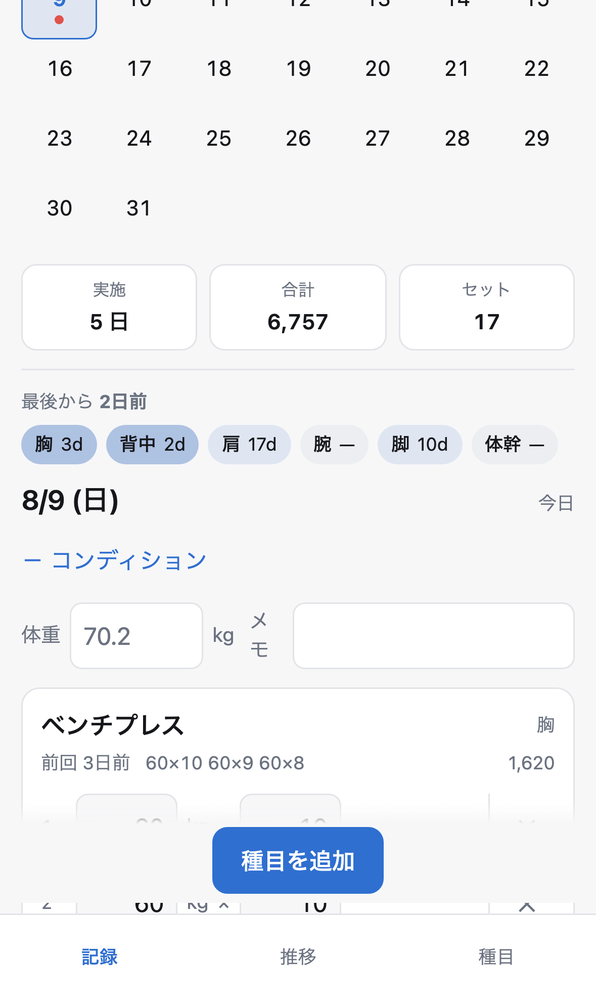
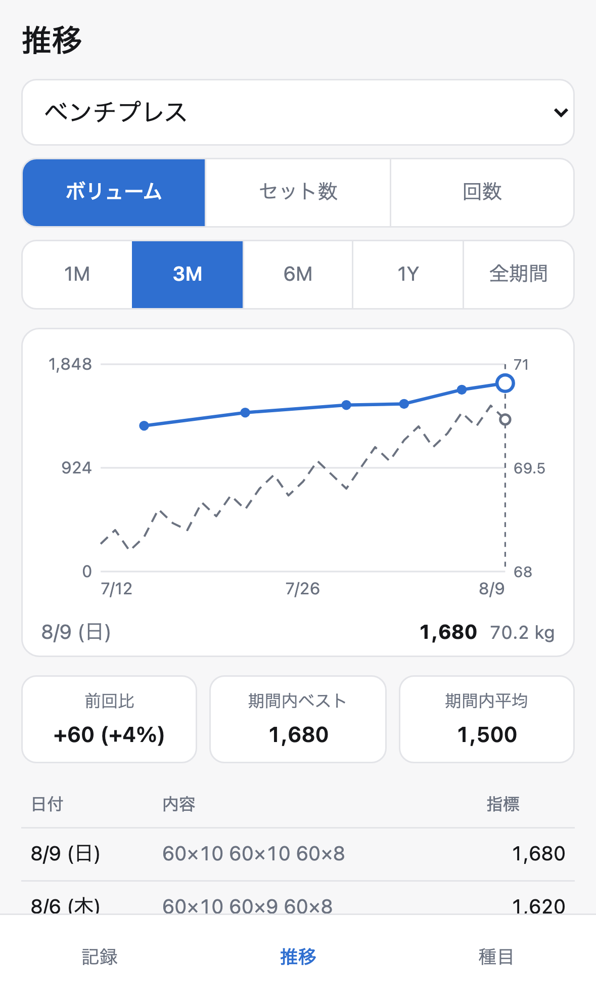
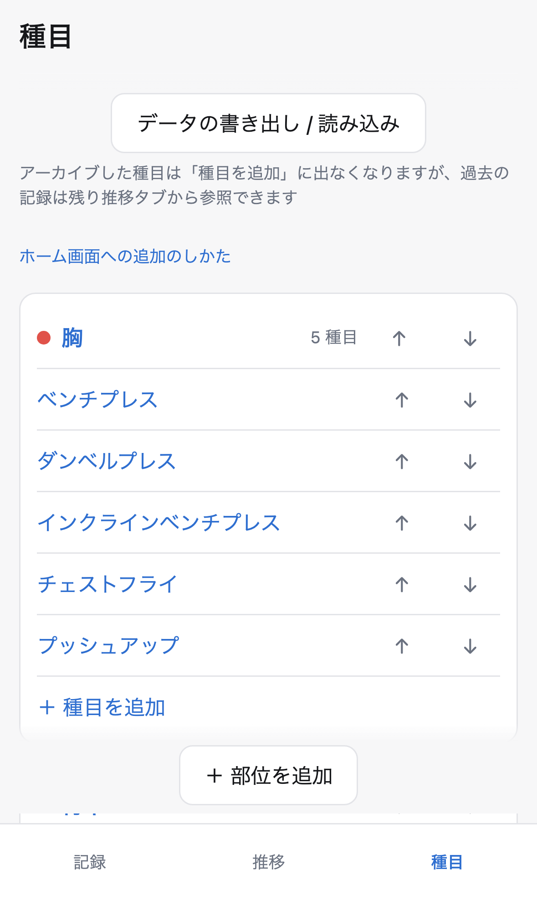

# 筋トレメモ

iPhone のホーム画面から起動して完全オフラインで動く、個人用の筋トレ記録 PWA。
サーバ通信もアカウント登録も持たず、記録は端末の `localStorage` にのみ保存する。
「前回何をどれだけやったかを見て、同じかそれ以上をやる」というループだけを最短手数で回すことに絞っている。

公開先: <https://asugawara.github.io/fitness-memo/>

## 画面

タブは **記録 / 推移 / 種目** の 3 つ。記録タブはカレンダーと選択日の入力欄が縦に並んだ 1 画面で、日セルをタップするとその下の入力欄がその日のものになる（[ADR-0035](adr/ux/0035-record-tab-calendar-with-day-editor.md)）。

| 記録 | 推移 | 種目 |
|---|---|---|
|  |  |  |

スクリーンショットは `trunk build && node scripts/shots.mjs` で撮り直す。端末（iPhone 15 Pro 相当）・standalone 起動・投入する記録を固定してあるので、UI を変えたら 3 枚まとめて同じ条件で更新できる。

## 主な機能

- **前回の参照とコピー** — 種目ごとに前回のセット数・レップ数・重量を表示する。その日のセットがまだ空のときだけ「前回をコピー」が出て、ワンタップで今日の入力欄にプリフィルできる。
- **カレンダーからの記録追加** — 記録タブは月グリッドと選択日の入力欄が縦に並んだ 1 画面。実施日は部位カラーのドットで示す。記録が無い日でも、**日セルをタップした時点で下の入力欄がその日のものになる**ので、前日の記録し忘れをタブ往復なしでそのまま入れられる。
- **部位ごとのグループ分け** — 胸 / 背中 / 肩 / 腕 / 脚 / 体幹 の 6 部位に 28 種目をプリセットとして初期投入する。部位も種目も追加・改名・並び替え・削除ができる。
- **仕事量のグラフ** — 種目別・部位別を折れ線で表示する。指標は ボリューム = Σ(重量 × 回数) / セット数 / 回数 をその場で切り替えられる。期間は 1M / 3M / 6M / 1Y / 全期間。
- **体重を第2軸に重ねたグラフ** — 記録した体重を、指標の折れ線と同じグラフに右軸の破線として**常に**重ねる（表示の切り替えは無い）。「重量は伸びたが体重も増えていたのか」を 1 画面で読めるようにするため。右軸は 0 起点ではなくデータに合わせるので、数百グラム単位の遷移も見える（[ADR-0044](adr/ux/0044-body-weight-second-axis-always-on.md)）。
- **最後のトレーニングからの経過時間** — 全体と部位ごとに表示する。過去日にさかのぼって記録した分は日粒度に落として表示する（「たった今」と誤表示しないため）。
- **体重と体調メモ** — 日ごとに 1 行で記録できる。トレーニングしていない日でも記録でき、その日も上のグラフに乗る。

**指標は種目の属性ではなくグラフの表示設定**にしている。種目ごとに単位が違うと同じ軸で比べられず、後から種目の性質が変わると過去のグラフが遡って壊れるため（[ADR-0033](adr/data-model/0033-metric-is-a-view-setting.md)）。重量欄は全種目に出し、**空欄は重量 1 として数える**ので、自重種目も時間種目も「入れなければよい」で成立する。

## 技術構成

| 項目 | 選択 |
|---|---|
| 言語 / フレームワーク | Rust + [leptos](https://leptos.dev/) 0.8（CSR）。ビルドは [trunk](https://trunkrs.dev/) |
| ルーティング | なし。タブは enum の signal で切り替える |
| グラフ | ライブラリを使わず SVG を自前で描画 |
| 永続化 | `localStorage` の単一キー `fitness-memo/v3` に JSON 全体（旧 `v2` / `v1` は読み取り専用で引き継ぐ） |
| CSS | 素の CSS 1 ファイル + CSS 変数 |
| デプロイ | GitHub Pages の branch deploy（`release` ブランチの `/docs`） |
| CI | **GitHub Actions のワークフローファイルを書かない。** `.githooks/pre-commit` でローカル実行する |

UI 層（`leptos` / `web-sys` に依存する部分）は `[target.'cfg(target_arch = "wasm32")'.dependencies]` に置いてあるので、`cargo test` はホスト向けに leptos の依存グラフをビルドしない。純ロジックは `src/core.rs`（`Db` を読む計算）と `src/chart_layout.rs`（グラフの座標計算）に集約してあり、ここが単体テストの主対象になる。

## 開発

### 前提ツール

- [rustup](https://rustup.rs/)（`rust-toolchain.toml` で stable と `wasm32-unknown-unknown` を宣言しているので、リポジトリ内での初回実行時にターゲットは自動で入る）
- trunk — `brew install trunk`
- Node.js（Playwright 用）

### セットアップ

```sh
sh scripts/setup.sh
```

`git config core.hooksPath .githooks` でフックを有効化し、`npm install` と Playwright のブラウザ（Chromium / WebKit）を入れる。**このスクリプトを実行しないと `pre-commit` は一度も発火しない。** GitHub Actions のワークフローを持たない構成なので、`pre-commit` が唯一の防波堤になる。

### 開発サーバ

```sh
trunk serve
```

<http://localhost:8080> で起動する。**この 8080 番では Service Worker を登録しない**（`index.html` が `location.port` で判定している）。開発中に cache-first の Service Worker に捕まって古い成果物を見続ける事故を避けるため。すでに登録済みの Service Worker を外したいときは `?sw=off` を付けて 2 回リロードする。

### テスト

```sh
cargo test                              # src/core.rs の純ロジック（ホスト）
trunk build                             # dist/ を作る（E2E はこれを配信する）
npx playwright test --project=chromium  # 軽い E2E
npx playwright test                     # 全 project（Chromium / iPhone 15 Pro (WebKit) / Pixel 7）
```

`.githooks/pre-commit` は `main` への `docs/` 混入をガードしたうえで、`cargo fmt --all -- --check` → `cargo clippy --target wasm32-unknown-unknown --all-features -- -D warnings` → `cargo test` → `trunk build` → `npx playwright test --project=chromium --project=harness` を順に実行する。緊急時は `SKIP_HOOKS=1 git commit` で飛ばせる。

複数人（または複数エージェント）で並行作業する場合、`dist/` と Playwright のポート 4173 は共有資源になる。出力先を分けたいときは `trunk build --dist <ディレクトリ>` と `DIST_DIR=<同じディレクトリ> npx playwright test` を組み合わせる。

## デプロイ

`main` はソースのみを持ち、`release` ブランチの `docs/` がビルド成果物であり **GitHub Pages の配信元**になる。`main` には `docs/` を絶対にコミットしない（混入すると以後のマージが modify/delete コンフリクトで停止する。`pre-commit` がガードしている）。

```sh
sh scripts/bootstrap-release.sh   # 初回 1 回だけ
sh scripts/release.sh             # 2 回目以降
```

`release.sh` は本番と同じパス構成（`--public-url /fitness-memo/`）でビルドし、WebKit と iPhone エミュレータを含む重い E2E を通してから `release` ブランチへの PR を作る。PR を **merge コミットで**マージすると Pages が自動デプロイされる（squash / rebase はリポジトリ設定で無効化してある。これらを使うと `main` のコミットが `release` の祖先に入らず、以後コンフリクトが多発する）。

> [!IMPORTANT]
> **リポジトリ設定の Actions を無効化してはいけない。**
> branch deploy を選んでいても、GitHub Pages は内部で必ず `pages build and deployment` というワークフローを実行する。Actions を無効にすると `Error: Actor is not allowed to trigger Actions workflows` でデプロイが止まる。「Actions を使わない」という方針は **`.github/workflows/` を書かない**という意味に限定される。

## iPhone へのインストール

> [!WARNING]
> **記録を付ける前に、先にホーム画面へ追加すること。**
> iOS では Safari のタブと、ホーム画面に追加した standalone PWA とで `localStorage` が共有されない。先に Safari のタブで記録を付けてからホーム画面に追加すると、PWA 側は空のデータベースで起動し、それまでの記録は見えなくなる。
> この状態になっても、Safari のタブ側で「データの書き出し」→ PWA 側で「読み込み」を通せば移行できる（種目タブの上部）。
> アプリ側でも、standalone で起動していないときは記録タブの末尾（「種目を追加」より下）に注意書きを出す。これは押せるボタンで、図解つきの手順シートが開く。**記録の邪魔をしないよう折り返しの下に置いてあるので、スクロールしないと見えない。**

1. iPhone の **Safari** で <https://asugawara.github.io/fitness-memo/> を開く（Chrome など他のブラウザではこの手順は使えない）
2. 画面の下のまん中にある共有ボタンを押す
3. リストを**下にスクロール**して「ホーム画面に追加」を選ぶ
4. 右上の「追加」を押す
5. **ホーム画面のアイコンから起動して**、そこで記録を始める

記録タブの注意書きが出なくなれば standalone で起動できている。出たままならまだブラウザのタブである。

一度追加すれば機内モードでも起動し、記録の追加・編集ができる。手順はアプリ内からも読める（記録タブの注意書き、または種目タブ冒頭の「ホーム画面への追加のしかた」）。

注意書きは ✕ で今後表示しないようにできる（`localStorage` の `fitness-memo/ui/v1` に記録され、`Db` には入らない）。消しても種目タブの導線は残るので、手順自体は読める。

## データを守る

記録は端末の `localStorage` にしかない。**同じ端末の中に何重にコピーを置いても、「履歴とWebサイトデータを消去」や機種変更では全部同時に消える**（iOS では localStorage と IndexedDB が同じ削除単位にある）。守れるのは端末の外に出したファイルだけなので、そこに絞ってある。

種目タブの上部「データの書き出し / 読み込み」から:

- **書き出し** — iPhone では共有シートが開く。**「ファイルに保存」→ iCloud Drive** を選ぶと機種を替えても残る。うまくいかないときは折りたたみの中にコピー用の全文がある
- **読み込み** — ファイルを選ぶか貼り付ける。実行前に「現在」と「読込後」の件数を並べて出し、**取り込む直前に今のデータを自動で退避**してから差し替える（直後なら 1 タップで戻せる）
  - **置き換える** — 丸ごと入れ替える。移行と復旧はこちら
  - **足すだけ** — 今の記録を 1 つも書き換えず、無い分だけ足す。2 台を統合するときはこちら
- **保管中のデータ** — 読み込みに失敗して退避されたデータや、取り込み前の控えを一覧から救い出せる

## 現時点の制限

- 保存済み JSON のパースに失敗した場合は、上書きせず `fitness-memo/v3.bak-<epoch>` に退避してから初期状態で起動し、起動時に一度だけ通知を出す（破損データをプリセットで黙って上書きしないため）。退避したデータは上記の「保管中のデータ」から取り出せる。
- 1 日 = 1 セッション、1 日 1 種目 1 ログ。日付はローカル日付なので、深夜 0 時をまたいだトレーニングは 2 日に分かれる。
- 自動バックアップは無い（iOS では共有シートもダウンロードもユーザー操作なしには起動できないため）。書き出しは手動で行う。

## 設計判断

この構成に至った経緯と、検討した代替案は [`adr/README.md`](adr/README.md) にまとめてある。
